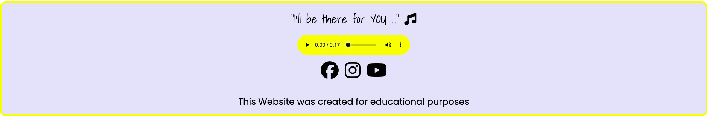
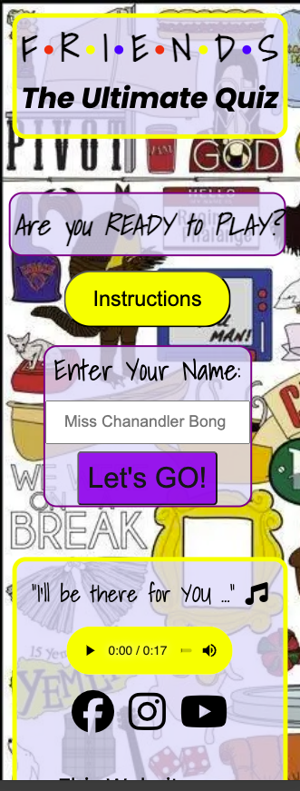
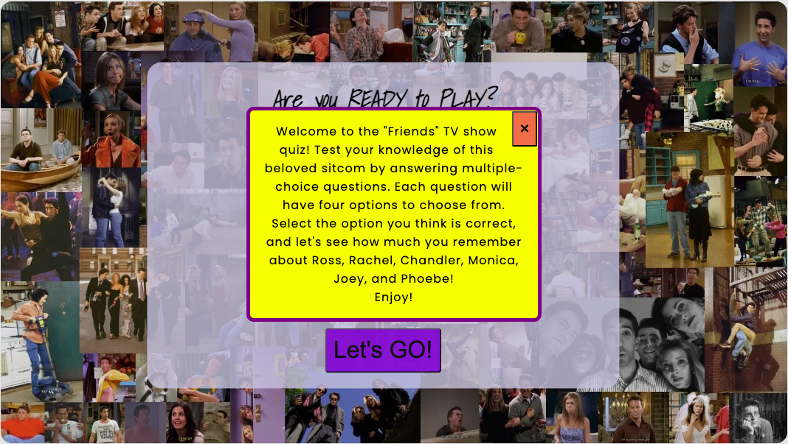
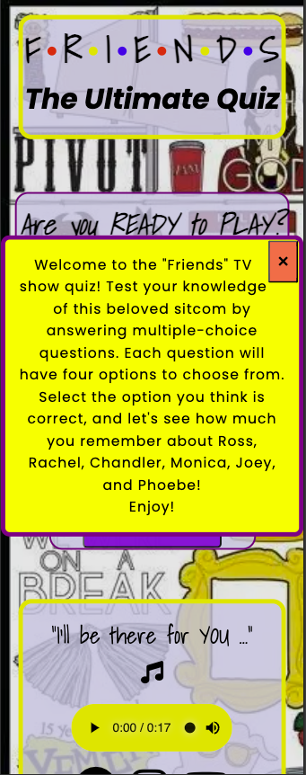

## F.R.I.E.N.D.S The Ultimate Quiz

Frinds The Ultimate Quiz is a trivia game inspired by the so called famous tv show. 

The Website is live now on [here](https://dianastrahilova.github.io/friends-quiz-pp2/)!

### UX

#### Purpose 
The quiz is designed to challenge the knowledge of users, containing ten fun quiestions from the show.
After clicking on an option, the user is immediately notified if their choice was correct or incorrect by highlighting the correct/incorrect answers. The final score shows the number of correct/incorrect answers, along with a congatulating message with the users' name and an engaging 'Play Again?' button.

#### Audience 
The quiz targets anyone who has ever watched the show to test their knowledge, while also having fun.

 

#### User Expectations

The design of the website is simple, fun and engaging. The user can start the quiz straight away by entering their name and hitting the start button. The questions then are immediately displayed and after choosing an option, and if the option is wrong, the right answer highlight in green and the next question loads. The user is notified of their score at the end of the quiz. The quiz has a local storage set up and the user will also be notified if they have a new higher score.
   
### Website Structure

   1. Intuitive to navigate.
   2. Engaging.
   3. Inviting for action.

### Design 
___
 **Start Area**

 The start area is displays the Friends Logo inside the header. Followed by the main content: a challeging heading "Are you READY to PLAY?", a pop up modal with instructions, an input field for the user's name and a start button.There is also a background image containing a collage of images with all the characters from Friends. It changes to a different one on smaller devices. The footer contains a snippet with the theme song and social media icons. 

  Desktop
  

  Desktop Footer
  

  Mobile 

  

  Mobile Footer

  

**Instructions Modal**

Desktop

Mobile 

___
**Quiz Area**

For each question there are 4 options to choose from. Once a choice is made, the buttons lock, preventing the user from making more choices.

Desktop Quiz

Mobile Quiz 

**Score**

The score is displayed at the end of the game and displays a message with the users's name the number of correct and incorrect answers. Also alerts if there is a new high score.

Desktop score 

---
**Testing**

- Website was tested and works in different browsers.
- The website is also responsive to all smaller devices, looks and functions good.
- The sign up form works and requires entries in every field.

**Validator Testing**

- HTML
   - No errors were returned when passing through the official [W3C Validator.](https://validator.w3.org/)

index.html

about.html

signup.html

- CSS
  - No errors were found when passing throught the official [(Jigsaw) Validator](https://jigsaw.w3.org/css-validator/)
style.css

- Accesibility 
   - Colors and fonts are easy to read and accesible by running it through Lighthouse in Devtools device toolbar.

Home Page 

About Page 

Sign Up 

---
### Deployment
The website was deployed to GitHub Pages. The steps are as follows.
   1. In the GitHub Repository go to Settings tab.
   2. Under Code and Automation, go to Pages.
   3. From the source section drop-down menu, select the Main Branch.
   4. Select save.
   5. Wait a couple of minutes for the website to go live.

 Link to the live website [here](https://dianastrahilova.github.io/moonexpeditionpp1/index.html)
---

### Reference and Credits 
**References**

   1. Code Institute Learning Modules.
   2. [Flexbox Froggy](https://flexboxfroggy.com/)
   3. The header and navbar menu was insipired by [Love Running Project](https://code-institute-org.github.io/love-running-2.0/index.html)
   4. More CSS exercises [W3schools](https://www.w3schools.com/)
 

### Content and Media
The content and media were taken from the followig resources:
   - Five out of the six images were AI generated from [Wowzer](https://app.wowzer.ai/).
   - The text content was created by [ChatGpt](https://chat.openai.com/), following my instructions.
   - Image of Moon's surface with Earth in the distance was downloaded from [Pexels](https://www.pexels.com/).
   - The Social Media Icons and the Triple Bar icon were downloaded from [Font Awesome](https://fontawesome.com/).
   - Google Fonts was used to define the fonts in the stylesheet. [Google Fonts](https://fonts.google.com/).
   - Colors used were simple black, white, purple and grey.
   - Favicon was AI generated from [Wowzer](https://app.wowzer.ai/) and converted into a Favicon with [Favicon Generator](https://favicon.io/favicon-converter/).
